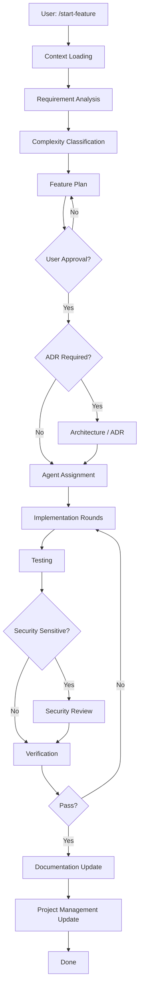

# Feature Lifecycle — MAX Sender

End-to-end workflow for developing features with AI agents.

## Overview



## Phases

### 1. Context Loading

**Skill:** `.cursor/skills/context-loading/SKILL.md`

Read project-management files and relevant docs before any work.

### 2. Requirement Analysis

**Agent:** `project-orchestrator`

- Parse user intent into business terms
- Map to modules: profiles, groups, messages, campaign, server, UI
- Identify local vs server impact

### 3. Complexity Classification

| Level | Criteria | Example |
|-------|----------|---------|
| LOW | 1 file, no security, no schema | Fix typo in UI label |
| MEDIUM | 2+ files or server+local | Server hooks + settings UI |
| HIGH | Architecture, migration, public exposure | PostgreSQL runtime switch |

### 4. Feature Plan

**Output:** Structured plan (see `project-orchestrator.md`)

**Gate:** User must approve before implementation.

### 5. ADR Phase (if required)

**When:** Complexity HIGH, or security/architecture tradeoffs

**Action:** Draft ADR in `DECISIONS.md` format, user approves, then implement.

### 6. Agent Assignment

Assign minimum necessary agents per plan. Default completion chain:

```
[specialist(s)] → qa-engineer (if tests needed) → verifier
```

### 7. Implementation

**Skill:** `.cursor/skills/subagent-orchestrator/SKILL.md`

- Round 1: foundation
- Round 2: core
- Round 3: polish (if needed)

**Model:** Composer 2.5 for code; GPT-5.5 for coordination.

### 8. Testing

**Agent:** `qa-engineer`

- Smoke tests for changed paths
- Manual steps for MAX API flows (cannot always automate)

### 9. Security Review (if applicable)

**Agent:** `security-engineer`

Required when feature touches:
- API PIN, auth middleware
- Session encryption
- Public endpoints
- File uploads
- Deploy exposure

### 10. Verification

**Agent:** `verifier`

Must produce PASS before feature is done.

### 11. Documentation Update

Update as needed:
- `README.md` / `server/README.md`
- Inline code comments (only non-obvious logic)
- `AUDIT.md` if closing known issues

### 12. Project Management Update

**Parent agent only:**
- `TASKS.md` — mark complete
- `PROJECT_STATUS.md` — update status table
- `HANDOFF.md` — session summary
- `CURRENT_CONTEXT.md` — if focus shifted

## Quick Reference Commands

| Command | Action |
|---------|--------|
| `/start-feature [desc]` | Begin new feature (planning) |
| `@project-orchestrator` | Manual planning invoke |
| `@verifier` | Validate completed work |

## Dual Deployment Checklist

For any backend/infra feature, confirm:

- [ ] Local `run.bat` still works
- [ ] Server Docker path tested or documented
- [ ] `static/index.html` works in both modes
- [ ] Secrets not committed

## Related Docs

- `docs/MASTER-AI-WORKFLOW.md` — master guide for all agents
- `.cursor/agents/README.md` — agent catalog
