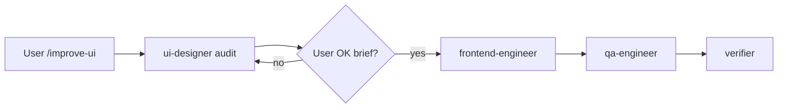

# UI Improvement Lifecycle

Entry: `/improve-ui [scope]` or Feature Plan with UI visual refresh.

## Flow

## Skills

1. `maxserver-ui-workflow` — master doc
2. `web-design-guidelines` + `ui-ux-pro-max` — audit
3. `frontend-design-max` — brief
4. `maxserver-static-ui` — implementation rules

## Files

- `static/index.html`, `static/admin.html`, `static/auth.html`
- Tests: `tests/test_saas_ux_static.py`

See also: `.cursor/commands/improve-ui.md`
