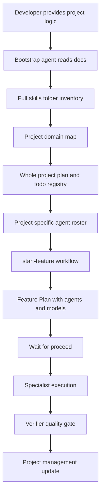

# AI Agent System Bootstrap

## Purpose

This folder is a portable bootstrap package for creating an AI-assisted development system in any new software project.

Use it when a developer starts a project from zero and wants an agent to build a project-specific system of:

- rules;
- skills;
- specialist agents;
- a project orchestrator;
- a verifier;
- a `/start-feature` workflow;
- project-management state files;
- a whole-project plan and shared todo registry;
- model routing;
- validation and handoff protocols.

The goal is not to copy the exact domain agents from this repository. The goal is to reproduce the same development mechanism and adapt the skills and agents to the logic of the new project.

## When To Use

Use this package for:

- websites;
- SaaS products;
- mobile applications;
- APIs and backend services;
- admin panels;
- marketplaces;
- e-commerce platforms;
- CRM/ERP tools;
- AI products;
- internal business applications.

## Required Inputs

Before running the bootstrap prompt, prepare:

1. A short project brief with the application logic.
2. The project folder that will contain or already contains a `skills` directory.
3. Any existing rules, architecture notes, product requirements, or technical constraints.
4. Preferred stack, if known.

The bootstrap agent must fully inspect the `skills` folder and choose only the skills that match the new project.

## Recommended Reading Order

Give the agent this folder and instruct it to read the files in this order:

1. `README.md` — how to use the package.
2. `BOOTSTRAP-PROMPT.md` — the prompt to run in the new project.
3. `AGENT-SYSTEM-SPEC.md` — the target AI system structure.
4. `PROJECT-PLANNING-AND-COORDINATION.md` — project roadmap, todo registry, file ownership, and handoff rules.
5. `START-FEATURE-WORKFLOW.md` — required `/start-feature` behavior.
6. `MODEL-ROUTING.md` — model selection policy.
7. `TEMPLATES.md` — reusable templates for generated files.
8. `VALIDATION-CHECKLIST.md` — final acceptance checks.

## Expected Result In A New Project

After reading these documents, the bootstrap agent should create a system similar in mechanics to this project:



## Non-Negotiable Behaviors

- The agent must inspect the full `skills` folder before creating agents.
- The agent must not create all possible agents "just in case".
- `project-orchestrator` must be readonly and must not write application code.
- `verifier` must be readonly and skeptical.
- `/start-feature` must produce a Feature Plan and wait for explicit `proceed`.
- Every Feature Plan must list agents, models, execution rounds, risks, and verification steps.
- Project state must be maintained in `.cursor/project-management/`.
- A whole-project plan and shared todo registry must be created before feature work.
- Parallel agents must not edit the same files unless the parent agent explicitly serializes ownership.

## Minimal System

Every generated project should have at least:

- `.cursor/agents/project-orchestrator.md`
- `.cursor/agents/verifier.md`
- `.cursor/skills/context-loading/SKILL.md`
- `.cursor/skills/start-feature/SKILL.md`
- `.cursor/skills/subagent-orchestrator/SKILL.md`
- `.cursor/workflows/feature-lifecycle.md`
- `PROJECT_ROADMAP.md` or `docs/PROJECT_PLAN.md`
- `.cursor/project-management/CURRENT_CONTEXT.md`
- `.cursor/project-management/PROJECT_STATUS.md`
- `.cursor/project-management/TASKS.md`
- `.cursor/project-management/DECISIONS.md`
- `.cursor/project-management/HANDOFF.md`
- `docs/MASTER-AI-WORKFLOW.md`

Additional agents are created only after domain analysis.

## First Command In The New Project

After the bootstrap agent creates the AI system, feature work should begin with:

```text
/start-feature [business feature]
```

Example:

```text
/start-feature создать каталог услуг с публичной страницей услуги и админским управлением
```

The orchestrator must show a plan and wait for `proceed` before implementation.

